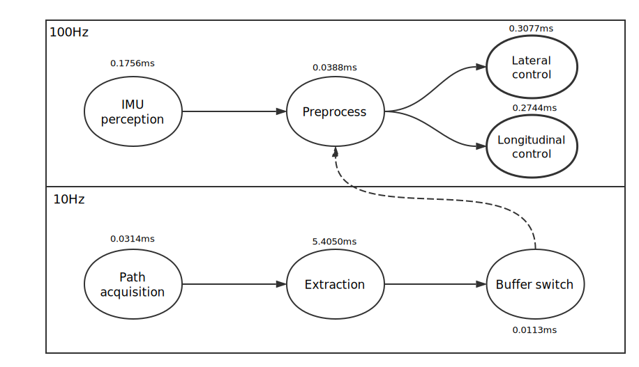

# 平均时间测试报告

## 项目背景

测试项目名为autopilot_controller，作用是控制无人车做横向轨迹跟踪和纵向速度跟踪。

## 硬件环境

树莓派3 B，铜片散热，无风扇，供电电源额定功率10W。一台Ubuntu系统电脑，电脑和树莓派3在一个子网。

## 软件环境

RASPBIAN JESSIE LITE，内核为4.9.35-rt25-v7，打了Linux RT-Preempt Patch。

## 测试方法

修改代码，仅需要修改Controller_msg.cpp，在需要的位置打时间戳，然后将时间戳写入文件。

```c++
...
#include <fstream>

using namespace std;

ofstream thread_ins_time_outfile("thread_ins_time.txt", ios::out);
ofstream thread_planner_time_outfile("thread_planner_time.txt", ios::out);

void LCMHandler_ins::handleMessage(const lcm::ReceiveBuffer* rbuf, const std::string& chan,
		const obu_lcm::ins_info* msg) {
	static clock_t time0, time1;
	// t0
	time0 = clock();
	controller_ptr->get_current_ins_info(*msg);

	// 本应从CAN总线获取总体车速，这里使用IMU数据代替
	controller_ptr->car_speed = controller_ptr->Current_Speed * 3.6;
	controller_ptr->Controller_preprocessing(*(controller_ptr->curr_path));
	// t1
	time1 = clock();

	controller_ptr->Controller_apply();

	//Write time to file
	thread_ins_time_outfile << " " << (time1 - time0) << " ";
	thread_ins_time_outfile << " " << controller_ptr->lat_control_time << " ";
	thread_ins_time_outfile << " " << controller_ptr->lon_control_time << endl;
}
...

void LCMHandler_planner::handleMessage(const lcm::ReceiveBuffer* rbuf, const std::string& chan,
		const obu_lcm::nav_control_points* msg) {
	// thread_planner_time.txt
	static clock_t time0, time1, time2, time3;

	// t0
	time0 = clock();

	if (controller_ptr->can_start_auto == 0 && controller_ptr->can_stop_auto == 1)
		return;

	int no_points = msg->num_of_points;
	static int road_change = -1;

	//    cout << "no_points=" << no_points << endl;

	if (no_points < 0 || no_points > 2000) {
		std::cerr << "Number of nav control points out of range!!! " << std::endl;
		std::cerr << "no_points=" << no_points << std::endl;
		return;
	} else if (no_points == 1 && msg->points.front().speed_desired_Uxs < 1.0) {
		// 规划层停车信号
		for (int i = 0; i < controller_ptr->curr_path->size(); ++i)
			controller_ptr->curr_path->ref_points[i].speed_desired_Uxs = 0.0;

	} else if (no_points < 10) {
		if (no_points != road_change)
			std::swap(controller_ptr->curr_path, controller_ptr->next_path);

		road_change = no_points;
	} else {
		controller_ptr->put_points_to_buffer_path(controller_ptr->next_path, msg);

		// t1
		time1 = clock();

		no_points = cau_all_output_from_single_spline_realtime(*(controller_ptr->next_path),
				controller_ptr->next_path->size());

		if (no_points < 10)
			return;

		// t2
		time2 = clock();

		std::swap(controller_ptr->curr_path, controller_ptr->next_path);

		controller_ptr->getting_motion_planner_point_num = no_points;
		controller_ptr->m_matching.init();

		// t3
		time3 = clock();

		thread_planner_time_outfile << " " << (time1 - time0) << " ";
		thread_planner_time_outfile << " " << (time2 - time0) << " ";
		thread_planner_time_outfile << " " << (time3 - time0) << endl;
	}
}
```
在电脑上运行AX7planner发送模拟生成的轨迹，运行oxford_parser模拟发送IMU数据（按正常速率100Hz发包），树莓派运行AX7controller，无执行器相应。运行完后保存两个生成文件，最后用MATLAB处理数据。

处理数据的代码为：
```matlab
clear;

Path = 'D:\ControllerTest\';

ins = importdata([Path, 'thread_ins_time.txt']);

i_inv0 = ins(:,1);
i_inv1 = ins(:,2) - ins(:,1);
i_inv2 = ins(:,3) - ins(:,2);

avg_i_inv0 = mean(i_inv0)/1000.0
avg_i_inv1 = mean(i_inv1)/1000.0
avg_i_inv2 = mean(i_inv2)/1000.0

planner = importdata([Path, 'thread_planner_time.txt']);

p_inv0 = planner(:,1);
p_inv1 = planner(:,2) - planner(:,1);
p_inv2 = planner(:,3) - planner(:,2);

avg_p_inv0 = mean(p_inv0)/1000.0
avg_p_inv1 = mean(p_inv1)/1000.0
avg_p_inv2 = mean(p_inv2)/1000.0
```

## 测试数据

AX7planner和oxford_parser每次需要同一个底图文件作为输入，AX7controller仅需要接收这两个程序发送的数据即可工作，测试的底图文件包括：
stdtest: 标准测试文件，路径包括从测试场到北门一圈。

tunnel_20170401143106： 西门隧道

testPlace_20170607115230：测试场

Vel_32_20160820115038.pcap：武汉碧桂园公路

## 测试结果
下图为AX7controller任务图，圆圈表示一个子任务，圆圈上标注了完成该任务的平均时间。

