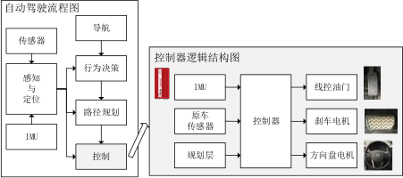
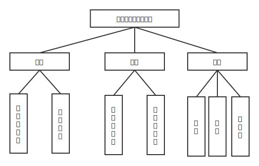

# 自动驾驶控制器软件 ROS 版本

## ROS 版本区别简单说明

配置文件同一放在 `config` 目录下，不需要配置环境变量。

运行 AX7 控制器命令：

```shell
$ rosrun autopilot_controller AX7controller
```

运行看门狗：

```shell
$ rosrun autopilot_controller controller_watchdog
```

## 简介
自动驾驶的总体框架如下图左所示，本工程为其中的控制层，功能是根据车辆的位置、姿态、速度、加速度等状态信息来控制车辆，进行高精度横向轨迹跟踪和纵向速度控制。



控制模块总览图展示了控制层与其他模块的连接。



模块的软件架构如上图所示，其中横向控制器根据轨迹曲率计算前馈控制，根据位置偏差和航向偏差计算反馈控制，输出方向盘转角；纵向控制器则采用PID控制，同时考虑车辆俯仰角的影响，输出油门和刹车值。

## 说明
### 1. Papers
本工程的纵向控制器使用了传统的PI控制方法，横向控制器控制算法参考Papers文件夹下论文“Autonomous vehicle control at the limits of handling.pdf”，大体架构没有变化，具体方法有一定改动，主要是在反馈部分加入了积分控制；在阻尼控制部分直接用车辆速度和航向角速度计算输出百分比。

papers文件夹中另有两篇论文分别是“AUTONOMOUS VEHICLE CONTROL AT THE LIMITS OF HANDLING.pdf”，这一篇属于手稿性质，其中的参数更详细，细节更多。另一篇“Autonomous Cornering at the Limits: Maximizing a “g-g” Diagram by Using Feedforward Trail-Braking and Throttle-on-Exit.pdf”着重描述纵向控制部分的算法原理，本工程代码中有一定程度的实现，但没有真正使用该方法，仅作为参考。

### 2. Related
包含配套的工程代码，可以参考每个工程的"README.md"。

##  依赖安装
### 1. 安装Boost
```
sudo apt-get install libboost-dev
sudo apt-get install libboost-system-dev
```

### 2. 安装CodeBlocks
可选，规划层IDE，也可以使用cmake来编译。
```
sudo add-apt-repository ppa:damien-moore/codeblocks-stable
sudo apt-get update
sudo apt-get install codeblocks
```

### 3. 安装Eclipse
可选，控制层IDE，也可以直接make，无需IDE。

#### 配置Java
到ORACLE官网下载[JDK][1]，下载后新建文件夹
```
sudo mkdir -p /usr/lib/jvm/
```

将下载的jdk解压到该目录，添加环境变量。
```
JAVA_HOME=/usr/lib/jvm
PATH=$JAVA_HOME/bin:$PATH
CLASSPATH=.:$JAVA_HOME/lib/dt.jar:$JAVA_HOME/lib/tools.jar
export JAVA_HOME
export PATH
export CLASSPATH
```

#### 安装Eclipse CDT
下载[Eclipse CDT][2]，解压后就可以打开，注意Eclipse的版本在eclipse-cpp-oxygen以上才可以兼容。

### 4. 安装Wireshark
可选，作为调试工具
```
sudo add-apt-repository ppa:wireshark-dev/stable
sudo apt-get update
sudo apt-get install wireshark
```

### 5. 安装Python调试工具依赖
可选，Python数据和信号处理库。
```
sudo apt-get install python-numpy python3-numpy
sudo apt-get install python-matplotlib python3-matplotlib
sudo apt-get install python-scipy python3-scipy
```

### 6. 安装LCM
#### autoconf
```
sudo apt-get install autoconf
```

#### libtool
```
sudo apt-get install libtool
```

#### 安装LCM
解压到合适位置，进入目录
```
sh bootstrap.sh
automake --add-missing
./configure
make
sudo make install
```

#### 动态链接库路径配置
修改 "/etc/ld.so.conf"，添加两行（若已存在则不要添加）
```
/usr/local/lib
/usr/lib
```

执行
```
sudo ldconfig
```

#### 安装lcm-python
安装python-dev
```
sudo apt-get install python-dev
```

进入LCM安装目录，打开lcm-python目录，安装
```
sudo python setup.py install
```

### 7. 安装OpenGL
```
sudo apt-get install mesa-common-dev libgl1-mesa-dev libglu1-mesa-dev
sudo apt-get install freeglut3-dev
sudo apt-get install subversion
sudo apt-get install libgtk2.0-dev libxmu-dev libxxf86vm-dev
```

### 8. 配置work环境变量
控制器需要放在work目录下，在/etc/environment文件中添加work目录的环境变量， 如WORKPATH="/home/用户名/work",然后修改"/etc/sudoers",在环境变量部分加入
```
Defaults        env_keep="WORKPATH".
```
在work目录下新建文本文件“local.txt”，内容为“22.9886565512 113.2691559583”，即广州经纬度，到其他地方必须修改该文件。

  [1]: http://www.oracle.com/technetwork/java/javase/downloads/jdk8-downloads-2133151.html
  [2]: http://www.eclipse.org/downloads/packages/release/Oxygen
  